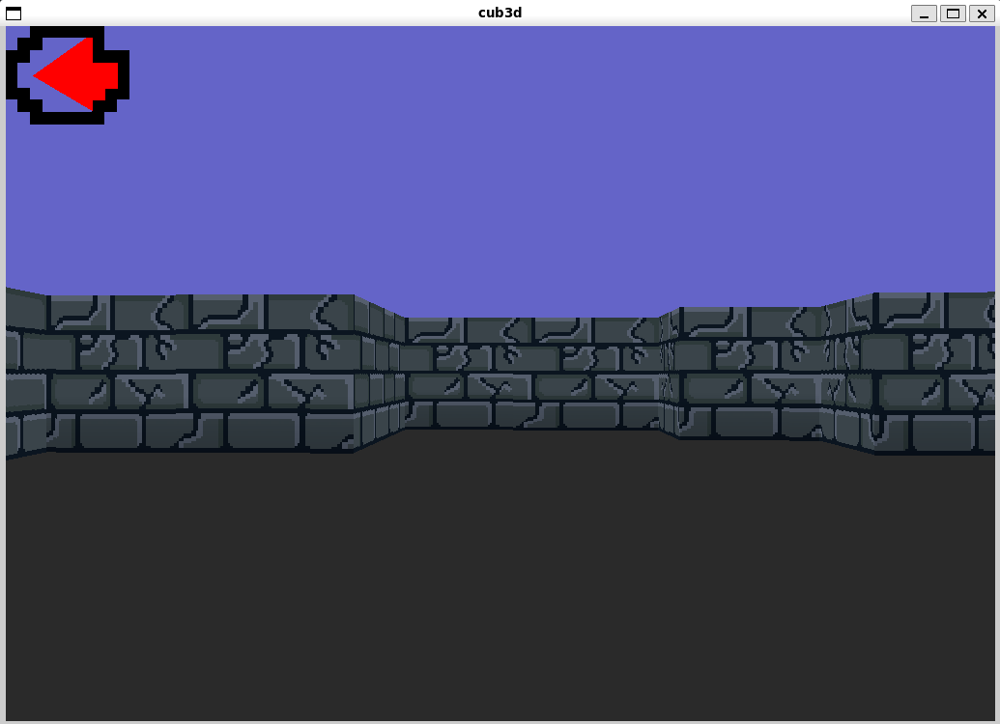
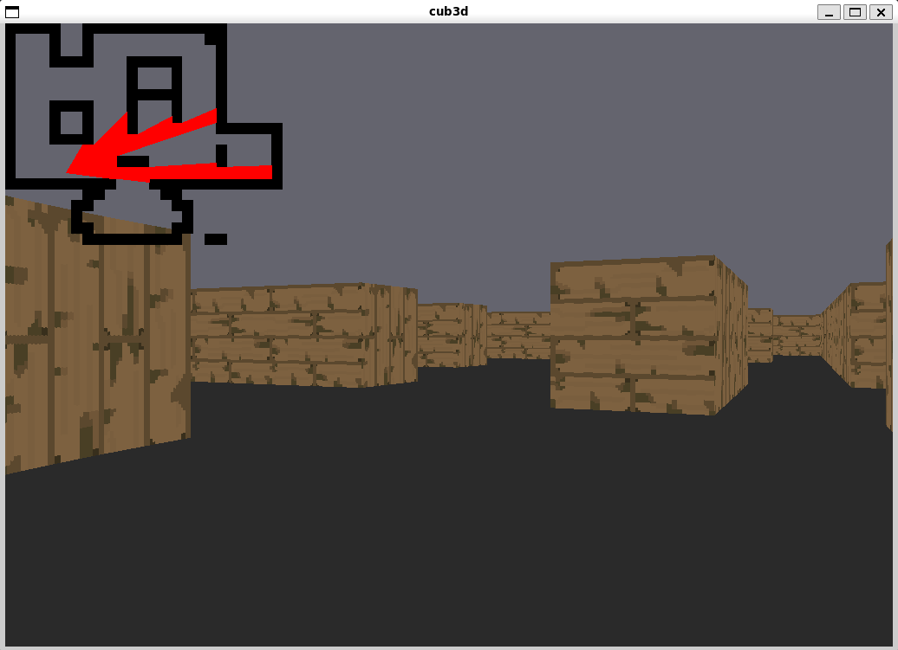
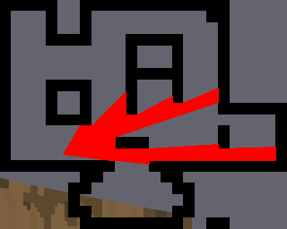

# 🎮 Cub3D - 3D Raycasting Engine

A 3D engine based on raycasting, implemented in C and inspired by the classic *Wolfenstein 3D*. Features real-time texture rendering with support for multiple maps and customizable textures.

## 📋 Requirements

### System Dependencies

* **gcc** or **clang** (C compiler)
* **X11** (Linux graphical server)
* **libXext** and **libX11** (X11 libraries)
* **libm** (math library)
* **libbsd** (BSD functionality)

### Installing Dependencies (Ubuntu/Debian)

```bash
sudo apt-get install gcc make libx11-dev libxext-dev libbsd-dev
```

### Installing Dependencies (Fedora/RHEL)

```bash
sudo dnf install gcc make libX11-devel libXext-devel libbsd-devel
```

## 🔨 Build

### Release Build (Optimized)

```bash
make
```

Creates the optimized binary at `bin/cub3d`

### Debug Build (With debug symbols)

```bash
make debug
```

Creates a debug binary at `debug/cub3d`

### AddressSanitizer Build (Memory checks)

```bash
make asan
```

Creates a binary with ASAN enabled at `asan/cub3d`

### Clean

```bash
make clean      # Remove object files
make fclean     # Remove all generated files
make re         # Rebuild everything
```

## ▶️ Run

### Basic Syntax

```bash
./bin/cub3d <map_path>
```

### Examples

```bash
./bin/cub3d maps/map.cub
./bin/cub3d maps/cube.cub
./bin/cub3d maps/forty_two_school.cub
```

### Available Maps

* `maps/map.cub` - Default map
* `maps/cube.cub` - Cube-shaped map
* `maps/alley.cub` - Alley
* `maps/demon.cub` - Demon map
* `maps/forty_two_school.cub` - 42 school map
* `maps/test.cub` - Test map
* `maps/vazio.cub` - Empty map

## 🎮 Controls

| Key           | Action        |
| ------------- | ------------- |
| `W`           | Move forward  |
| `A`           | Move left     |
| `S`           | Move backward |
| `D`           | Move right    |
| `Left Arrow`  | Turn left     |
| `Right Arrow` | Turn right    |
| `ESC`         | Exit the game |

## 🗺️ Map and Texture Format

### `.cub` File Structure

A `.cub` map file defines rendering parameters and the map layout. Example:

```
NO ./assets/textures/north.xpm
SO ./assets/textures/south.xpm
WE ./assets/textures/west.xpm
EA ./assets/textures/east.xpm

F  0,0,0
C  225,30,1

111111111
101000001
100000001
100N00001
100000001
100000001
100000001
100000001
111111111
```

### Required Elements

| Element | Description           |
| ------- | --------------------- |
| `NO`    | North wall texture    |
| `SO`    | South wall texture    |
| `WE`    | West wall texture     |
| `EA`    | East wall texture     |
| `F`     | Floor color (R,G,B)   |
| `C`     | Ceiling color (R,G,B) |

### Map Symbols

| Symbol | Meaning                     |
| ------ | --------------------------- |
| `1`    | Wall                        |
| `0`    | Empty space                 |
| `N`    | Player start (facing North) |
| `S`    | Player start (facing South) |
| `E`    | Player start (facing East)  |
| `W`    | Player start (facing West)  |

### Color Palette (RGB)

#### Texture Files

You can use any texture in XPM format. Default textures are located in `assets/textures/`:

```
assets/textures/
├── north.xpm
├── south.xpm
├── west.xpm
└── east.xpm
```

#### Floor and Ceiling Colors

Colors are defined in RGB format (0–255 per component):

```
F  255,0,0      # Red
C  0,255,0      # Green
F  0,0,255      # Blue
C  128,128,128  # Gray
F  255,255,255  # White
C  0,0,0        # Black
```

### Creating Custom Textures

1. Create an image in XPM format
2. Place it in `assets/textures/`
3. Update the `.cub` file with the texture path
4. Run the program

Example:

```
NO ./assets/textures/my_north_texture.xpm
SO ./assets/textures/my_south_texture.xpm
WE ./assets/textures/my_west_texture.xpm
EA ./assets/textures/my_east_texture.xpm

F  100,50,200
C  200,100,50
```

## 📸 Screenshots

### Main Gameplay View





### Minimap

The game includes a minimap in the top-left corner showing:

* Player position
* Player direction view (red lines)
* Map layout (walls in black, empty space in transparency mode)



## 🏗️ Project Structure

```
cub3d/
├── assets/
│   └── textures/          # Texture files (.xpm)
├── includes/
│   ├── cub3d.h            # Main header
│   └── parser.h           # Map parser
├── libft/                 # Custom C library
├── mlx/                   # MinilibX (graphics rendering)
├── src/
│   ├── main.c             # Entry point
│   ├── utils.c            # Utility functions
│   ├── draw/              # Drawing functions
│   ├── game_loop/         # Main game loop
│   ├── map/               # Map logic
│   ├── parser/            # .cub file parser
│   ├── player/            # Player logic
│   ├── rays/              # Raycasting engine
│   ├── render/            # Wall rendering
│   ├── scene/             # Scene rendering
│   ├── textures/          # Texture management
│   └── utils/             # Misc utilities
├── maps/                  # Map files (.cub)
├── Makefile               # Build script
└── README.md              # This file
```

## 🔧 Troubleshooting

### Error: "cannot open shared object file"

```bash
# Rebuild MLX library
cd mlx && make clean && make
cd ..
make re
```

### Error: "X11 not found"

Install X11 development dependencies:

```bash
sudo apt-get install libx11-dev libxext-dev  # Ubuntu/Debian
sudo dnf install libX11-devel libXext-devel  # Fedora/RHEL
```

### Game does not respond to controls

* Make sure the game window is focused (click on it)
* Check that no keys are stuck

### Textures not displaying

* Verify the path in the `.cub` file (relative to the current directory)
* Ensure the texture file is a valid XPM format

## 📚 References

* https://github.com/42Paris/minilibx-linux
* https://en.wikipedia.org/wiki/Ray_casting
* https://en.wikipedia.org/wiki/Wolfenstein_3D
